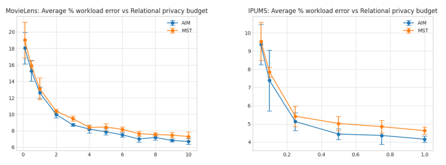

# Differentially Private Synthetic Data Generation for Relational Databases
This repo contains the code for [Differentially Private Synthetic Data Generation for Relational Databases](https://arxiv.org/abs/2405.18670), a paper which brings differentially private (DP) synthetic data generation to relational databases.

Abstract:
> Existing differentially private (DP) synthetic data generation mechanisms typically assume a single-source table. In practice, data is often distributed across multiple tables with relationships across tables. In this paper, we introduce the first-of-its-kind algorithm that can be combined with any existing DP mechanisms to generate synthetic relational databases. Our algorithm iteratively refines the relationship between individual synthetic tables to minimize their approximation errors in terms of low-order marginal distributions while maintaining referential integrity. This algorithm eliminates the need to flatten a relational database into a master table (saving space), operates efficiently (saving time), and scales effectively to high-dimensional data. We provide both DP and theoretical utility guarantees for our algorithm. Through numerical experiments on real-world datasets, we demonstrate the effectiveness of our method in preserving fidelity to the original data.

# Installation
To start using this code, install the required packages using pip. This code has been run on Python 3.11, but should work on other versions as well.
```bash
pip install -r requirements.txt
```
The dependencies are:
- `matplotlib`
- `numpy`
- `pandas`
- `tqdm`
- `smartnoise-synth` (this may be sticky to install)
- `torch` with GPU support!
- `mosek` (this is not needed in the current model used, and it may be possible to safely remove imports for this)

# Quickstart usage
If you wish to run the code on the IPUMS dataset, you should run the following command first, which uses the `ipumspy` package to read the data file in this repository and preprocess it for use in the code:
```bash
python ipums_setup.py
```

After this, you should be ready to start running experiment files! The main experiment results in the paper were generated with the `experiment_pgd_ipums_v2_medium_all.py` and `experiment_pgd_movielens_all.py` files which you can directly run. After some time, these will generate results into the `runs` folder. These can be read to generate plots using `load_experiments_v2.ipynb`, like the figures in the paper!


# Library documentation
The main library code is in the `dp_relational` folder. We discuss each file here, one by one:

## `lib`
The `lib` folder contains the main infrastructure library code for this project.
### `runner.py`
This is the main file for high level running of experiments, and this declares the `ModelRunner` class. This saves many parameters in the model, and takes in a `qm_generator` function to create a `QueryManager` from a dataset, and a `cross_generation_strategy` which runs the main loop of the algorithm, and returns a synthetic Pandas dataframe. The runner runs the following steps:
1. Runs any code to generate the raw data tables themselves
2. Generates the individual synthetic tables using `smartnoise-synth` synthesizers.
3. Creates a `QueryManager` from the raw and synthetic tables.
4. Runs the `cross_generation_strategy` to iteratively refine the synthetic tables based on the relationships between them.

The ModelRunner is designed for repeated running after changing parameters: if parameters are changed, it will try to reuse as many previous results as it can. It gives each run a run_id and saves intermediate results in the `runs` folder, which can be reused in future runs.

There is also a `load_artifacts` function which, given a `run_id`, will load the dataset and single synthetic tables from the `runs` folder, and set them in the ModelRunner. This is useful for debugging or reusing results without recomputing them, although for best results it is advised to set the `regenerate_qm` and `regenerate_cross_answers` flags to `True` to recompute the QueryManager and cross answers.

### `qm.py`
This file contains the `QueryManager` class, which is used to manage the queries and relationships between the tables. It takes in a list of raw tables and sizes of desired synthetic tables, and allows for the efficient computation of k-way marginal queries on synthetically generated b vectors (see the paper for details on the b vector, but this is a flattened version of the synthetic tables) and synthetically generated data frames. It also contains helper functions to identify indices of relationships in this b vector which correspond to individual marginal queries.

The QueryManager is heavily used to produce the Q query matrix (in both the full table and sub table slices), for finding relevant indices into dataframes for the final answers, and for computing the answers to queries on synthetic data during generation. There is a provided `QueryManagerBasic` class (for initial correctness testing), but the `QueryManagerTorch` class should be primarily used.

### `dataset.py`
This contains helper functions for working with a general set of datasets, and basic preprocessing of data. It contains a `Table` class which represents the individual raw tables. Each table has an `id_col` as the primary key for this table. A `Table` also supports one-hot encoding of category columns, if these are provided (all non-id columns are one-hot encoded by default). A `RelationalDataset` is constructed from two tables, each with a given id column / primary key, and a `df_rel` DataFrame, which contains one row for each relationship between the two tables, with the primary keys of each table in the row. The `RelationalDataset` class code also prunes excess relations in the individual tables (to meet the $d_{max}$ constraint from the paper).

### `synth_strategies` folder
This contains a variety of different algorithms we explored during this project. The main algorithm used in the paper is `torch_pgd.py`, although another up to data variation is `torch_pgd_otm.py`, which constrains the output relationships to be one-to-many. These functions have many inputs for all the different hyperparameters, but they are well documented in the code. For reference, here is the description of the main function of `torch_pgd.py`:
``` python
    """Implementation of new PGD based algorithm
     - Exponential mechanism to choose queries from the set 
     - Unbiased estimator algorithm
     - Optimal gradient descent algorithm.
    
    Information on parameters:
    qm: a query manager to produce query matrices
    epsilon_relationship: the privacy budget allocated to the relational table
    delta_relationship: the delta privacy parameter
    T: the number of iterations to run
    subtable_size: the size of the subtable to generate. This is related to the alpha parameter by sqrt(subtable_size / (n_syn1 * n_syn2))
    queries_to_reuse: the number of queries that we will evaluate in each iteration. Set to None to run all.
    k_new_queries: number of new queries to add to our set in each iteration
    k_choose_from: number of queries to evaluate when running the exponential mechanism
    """
```
The other strategies should be considered out of date.

### `helpers.py`
This contains various helper functions used throughout the codebase. It includes functions for:
- Mirror descent
- The efficient unbiased sampling algorithm described in the paper
- Differentially private noise addition
- Computation of per round privacy budget
- Optimal projection back onto the correct simplex
and more.

### `synth_data.py`
This file contains functions to compute synthetic data for a single table given a synthesizer, using smartnoise-synth. It also contains functions to convert the rounded b vector (as described in the paper) into a valid DataFrame, describing the relationships between the tables.

## `datasets`
This contains the primary code for preprocessing of the MovieLens and IPUMS datasets into the `RelationalDataset` format supported by the rest of the code (described earlier). The MovieLens dataset is a dataset between users and movies, with the relationships being the movies that users have rated. The IPUMS dataset is a dataset between individuals and other individuals, with the relationships being parent-child relationships. There is also an IPUMS dataset for only child-mother relationships to demo one-to-many relationships.

To add a new dataset, make sure to implement a new function that returns a relational dataset, given $d_{max}$ as a parameter.

# Contact
Feel free to reach out to the authors for any help with the code or questions about the paper!
- Kaveh Alim: mrz [at] mit [dot] edu
- Hao Wang: hao-wang [at] redhat [dot] com
- Ojas Gulati: ojasg [at] mit [dot] edu
- Akash Srivastava: akash [at] redhat.com
- Navid Azizan: azizan [at] mit.edu
